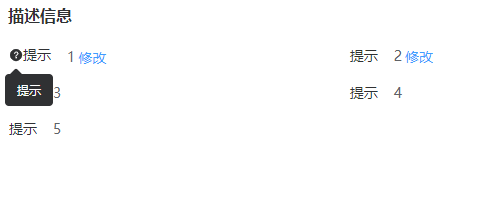

## 基础使用



```js
import { defineComponent } from "vue";
import { Descriptions } from "el-table-jsx";
import { QuestionFilled } from "@element-plus/icons-vue";

export default defineComponent({
  setup(props, { emit }) {
    const desRightClick = (item) => {
      console.log("desRightClick", item);
    };

    return () => (
      <Descriptions
        title={"描述信息"}
        width={500}
        desInfo={{
          title: "概要消息",
          desArr: [
            {
              label: "提示",
              val: "1",
              btn: {
                type: "primary",
                link: true,
                txt: "修改",
              },
              tooltipInfo: {
                icon: QuestionFilled,
                content: "提示",
              },
            },
            {
              label: "提示",
              val: "2",
              btn: {
                type: "primary",
                link: true,
                txt: "修改",
              },
            },
            {
              label: "提示",
              val: "3",
            },
            {
              label: "提示",
              val: "4",
            },
            {
              label: "提示",
              val: "5",
            },
          ],
        }}
        column={2}
        onDesRightClick={desRightClick}
      ></Descriptions>
    );
  },
});

```

## 事件

| 属性名        | 说明          | 出参 |
| ------------- | ------------- | ---- |
| desRightClick | desRightClick |      |

## 属性

| 属性名  | 说明                          | 默认值 | 类型   |
| ------- | ----------------------------- | ------ | ------ |
| desInfo | Descriptions 配置             | {}     | object |
| column  | 一行 Descriptions Item 的数量 | 3      | number |