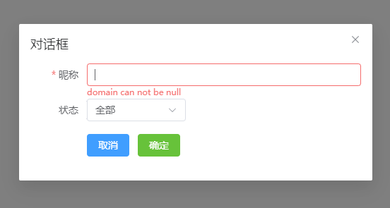

## 基础使用



```js
import { defineComponent } from "vue";
import { Dialog, Form } from "el-table-jsx";

export default defineComponent({
  setup(props, { emit }) {
    return () => (
      <div>
        <Dialog
          dialogVisible={true}
          title={"对话框"}
          width={500}
        >
          <Form
            labelWidth={80}
            formColumns={[
                {
                    prop: "name",
                    label: "昵称",
                    filterType: "input",
                    rules: {
                        required: true,
                        message: 'domain can not be null',
                        trigger: 'blur',
                    }
                },
                {
                    prop: "state",
                    label: "状态",
                    filterType: "select",
                    defaultVal: 0,
                    width: "140",
                    option: [
                        { label: "全部", value: 0 },
                        { label: "通过", value: 1 },
                    ],
                },
                {
                    filterType: "btn",
                    btnArr: [
                        { btnId: 0, label: "取消", color: "primary" },
                        { btnId: 1, label: "确定", color: "success" },
                    ],
                },
            ]}
            inline={false}
          />
        </Dialog>
      </div>
    );
  },
});

```

## 事件

| 属性名        | 说明              | 出参 |
| ------------- | ----------------- | ---- |
| onCloseDialog | Dialog 关闭的回调 |      |

## 属性

| 属性名        | 说明           | 默认值 | 类型    |
| ------------- | -------------- | ------ | ------- |
| dialogVisible | 是否显示对话框 | false  | boolean |
| title         | title          |        | string  |
| width         | width          |        | number  |